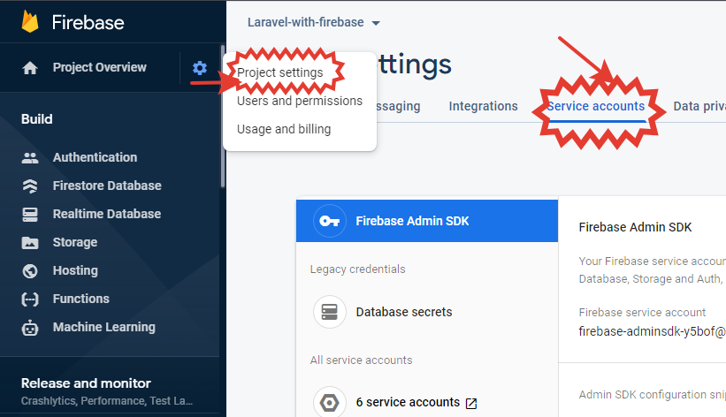

# How to install laravel with Firebase firestore

## 1.install new laravel project

    laravel new project

## 2.install required packages

    composer require kreait/laravel-firebase

    composer require google/cloud-firestore

### Notes
### you need to install gRPc
- **[gRPc](https://pecl.php.net/package/gRPC)**

    ### This video show you how to install it
    https://www.youtube.com/watch?v=B9du2TnZryc&t=3s

## 3.got to firebase and create new project

    put this json file in your laravel project
    edit .env file with file name
    FIREBASE_CREDENTIALS=firebase-credentials.json

### firebase connected successfully 

## now you can make your crud

    get => app('firebase.firestore')->database()->collection('Chat')->documents();
    store => app('firebase.firestore')->database()->collection('Chat')->newDocument();
    update => app('firebase.firestore')->database()->collection('Chat')->document($id)
            ->update([
                ['path' => 'chatting', 'value' => $request->chatting],
            ]);
    delete =>         app('firebase.firestore')->database()->collection('Chat')->document($id)->delete();

